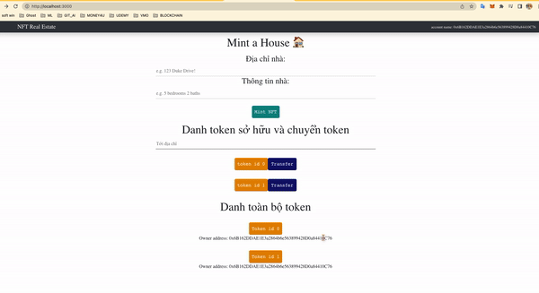

# NFT

Contract address: https://rinkeby.etherscan.io/address/0x1FD9b21091779533Afb8FEDC58Fd83a2a7F0a281

## Overview

This project is a full-stack web3 development, that is built in react/javascript, solidity and CSS. The program renders a
website, where clients can mint real estate by inputting the address and description of the house they would like to mint to
the ethereum blockchain.

  

## Instructions

1. Install metamask for chrome: https://metamask.io/download.html

2. To get the script working, type the following commands into a new terminal window...

- requirement environment : nodejs
- `git clone https://github.com/neckgamervn/nft-real-estate nft-realestate`
- `cd nft-realestate`
- `npm install -g yarn`
- `yarn`
- `yarn start`

## For ganache, you can ignore if use rinkeby.

3. Install ganache (private blockchain for testing): https://www.trufflesuite.com/ganache
4. Open ganache, do quickstart, then on the far right side of the first address click the key icon, copy the private key,
   add that private key into your meta mask to make an account and call it something like ganache testing
5. Add a custom rpc on meta mask for ganache: name it ganache network, all info for all fields is found on the top bar of your
   ganache application you have open.
6. Choose the ganache testing account in metamask which should be loaded with 100 ETH for testing, and choose the ganache
   network you added to connect.

## Deploy (Optional, Ignore if you dont want deploy new token. We already deploy on rinkeby and folder `src/build` existed)

7.  Open new terminal, run `npm install -g truffle` Then `truffle compile`.
8.  Then run `truffle migrate` for ganache or `truffle migrate --network rinkeby` for rinkeby testnet. You will create a new `build` folder. Delete folder `src/build`, and move the new one into its place.

## Testing

9. Open in a chrome browser: http://localhost:3000/
10. Mint some NFTs on your fake blockchain and have fun! The transaction will appear in the console after you approve it in
    the metamask popup!
